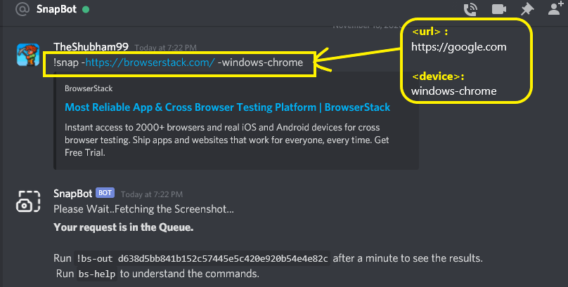
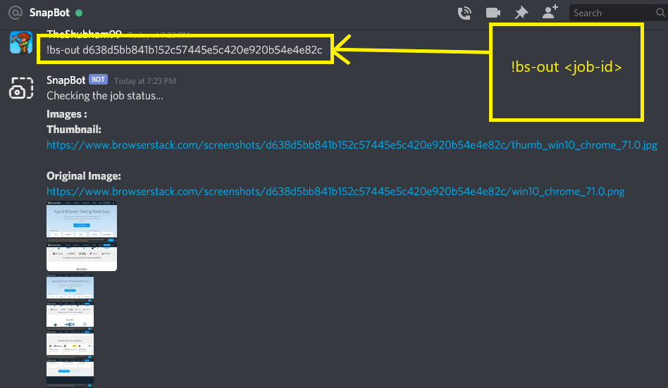

# BS-ScreenShot / SnapBot

It's a simple discord bot built to see how a particular website looks on a particular device. The bot is Powered by **[@BrowserStack's](https://github.com/browserstack) ScreenShot API**.

## What It will do?

_It will send you the screenshot of the website you mentioned in the command._

## How to test?

1. Log in to your **[Discord](https://discord.com)** Account.
2. Visit the following link -\
   [https://discord.com/oauth2/authorize?client_id=775333766141837313&scope=bot](https://discord.com/oauth2/authorize?client_id=775333766141837313&scope=bot)
3. Add the bot to your server.

## Commands

1️⃣

> **!snap -{url} -{device}**

_Takes a screenshot of {url} using {device}._

**Try** `!snap -https://google.com -windows-chrome`\
**_{url}_** : https://google.com \
**_{device}_** : windows-chrome

2️⃣

> **!bs-devices**

_Returns the list of supported devices._

3️⃣

> **!bs-out -{token}**

_Checks the status of the screenshot job and returns the screenshot if the job is completed._

4️⃣

> **!bs-help**

_Returns this menu._

## Contribute

1. fork and clone the repository.
2. Run `npm install` or `yarn`.
3. create a `.env` file and add your [BrowserStack](https://github.com/browserstack) credentials as - \
   `BSTACK_USER`- Username. \
   `BSTACK_PASS`- Password.
4. Also add Discord Secret token to the `.env` file as - \
   `DISCORD_BOT_TOKEN` - Token
5. Run the server by the command `npm .` _( npm[space][dot] )_

## Screenshots

---

## License

[MIT](https://choosealicense.com/licenses/mit/)

Built with :heart: by _**[@TheShubham99](https://github.com/theshubham99)**_
